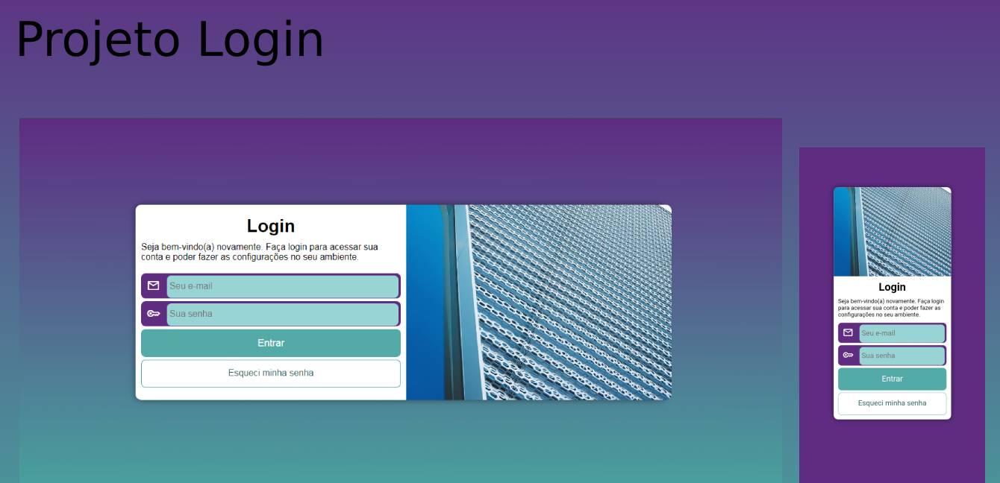

<h1 align="center">Projeto Login</h1>

  <a href="#-tecnologias">Tecnologias</a>&nbsp;&nbsp;&nbsp;|&nbsp;&nbsp;&nbsp;
  <a href="#-projeto">Projeto</a>&nbsp;&nbsp;&nbsp;|&nbsp;&nbsp;&nbsp;
  <a href="#memo-licença">Licença</a>

  

 

  

## 🚀 Tecnologias

Esse projeto foi desenvolvido com as seguintes tecnologias:

- HTML e CSS
- Git e Github

## 💻 Projeto

Projeto de uma tela de login (que poderia ser de qualquer sistema) sem nenhuma real funcionalidade, é totalmente responsivo para desktops, tablets e mobile. Tem alguns sistemas de controle em inputs e verificação.

## :memo: Licença

Esse projeto está sob a licença MIT.

---